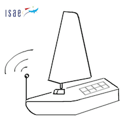
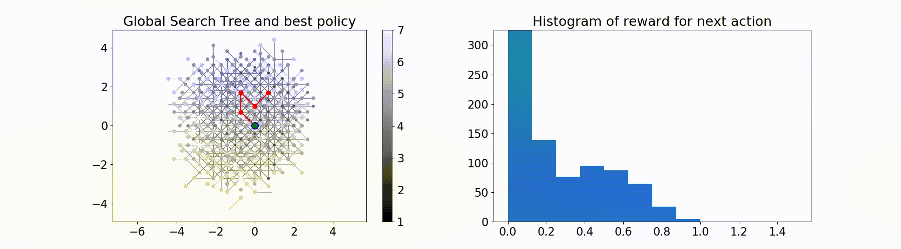
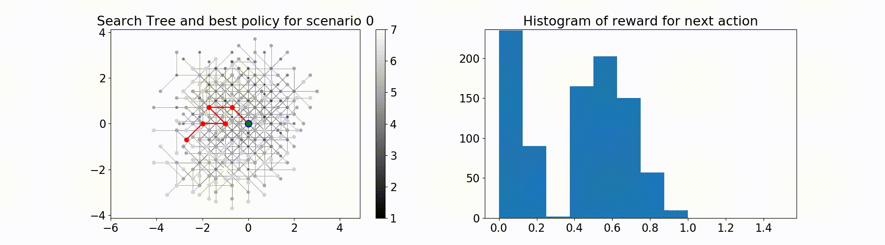
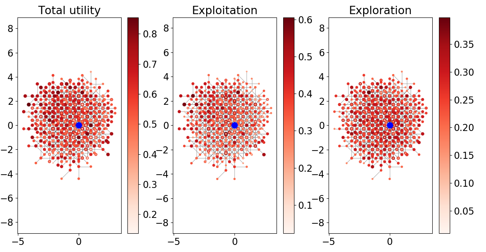
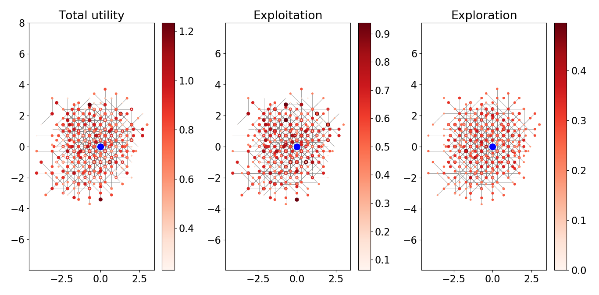
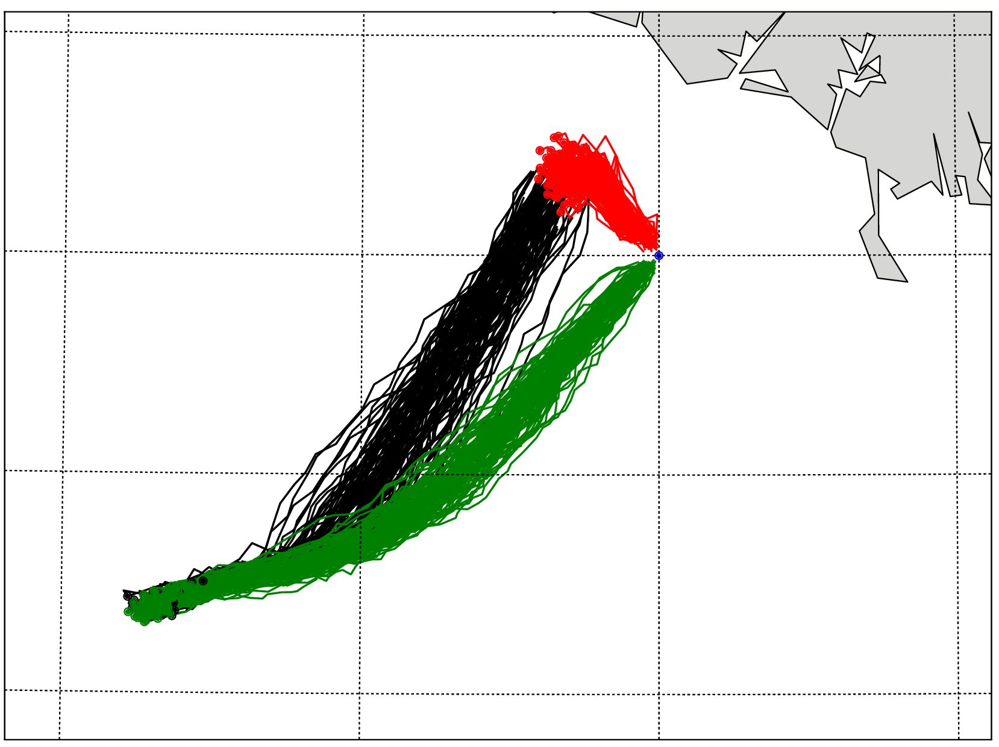
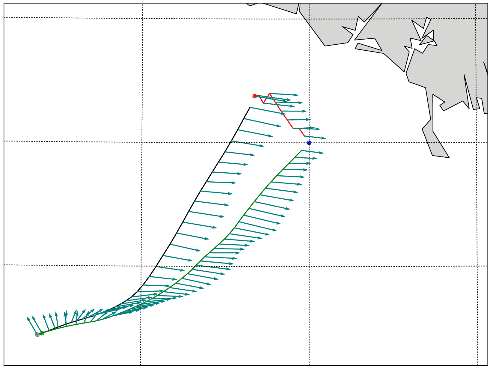

<h1 align="center">
  Welcome to the  
  IBOAT - Parallel Monte-Carlo Tree Search Project
   
  
   
</h1>

<h1 align="center">
  
  
  
</h1>

<h4 align="center">Routing an autonomous sailboat with Reinforcement Learning </h4>

  <a href="#context">Context</a> •
  <a href="#prerequisites-and-code-documentation">Documentation</a> •
  <a href="#usage">Usage</a> •
  <a href="#getting-started">Getting started</a> •
  <a href="#built-with">Tools</a> •
  <a href="#related">Related</a> •
  <a href="#acknowledgments">Acknowledgments</a> •
  <a href="#gallery">Gallery</a>

## Context

In this project we develop **a reinforcement learning algorithm** based on **parallel Monte-Carlo tree search**
to tackle the problem of **long-term path planning under uncertainty** for offshore sailing. This domain of application
is challenging as it combines unreliable and time varying wind conditions with complex and uncertain boat performances.
Contrarily to state of the art approaches applied to the sailing problem, we build a generator that models state transitions
considering these two types of uncertainty. The first one is on the boat dynamics : given a environment state the boat performances
are not deterministic. And the second one is uncertain weather forecasts. In practice, the wind is estimated from multiple
weather forecasts (each one of them being a weather scenario with a given probability of happening). The boat’s dynamics are evaluated with
a noisy Velocity Prediction Program (VPP). Then, a Monte Carlo Tree Search (MCTS) algorithm is applied in parallel to all the weather
scenarios to find the sequence of headings that minimizes the travel time between two points.

## Prerequisites and code documentation

The documentation as well as the prerequisites can be found on the following webpage :

  

## Usage

This repository is intended to be a **tool** for future work on the problem of
**long-term path planning under uncertainty** for offshore sailing.
The tools that are provided are the following :

- Processing of real weather forecast data
- A Parallel Monte-Carlo Tree Search algorithm
- A Isochrones algorithm as reference and performance validation
- Results visualisation and decision support

## Getting started

Before doing anything you should have a look at the [Jupyter](http://jupyter.readthedocs.io/en/latest/install.html) notebook tutorial [Tutorial.ipynb](code/Tutorial.ipynb) and its `.py` version [Tutorial.py](code/Tutorial.py).

## Built With

  
  
  

## Related

This project falls under the IBOAT project and is related to the repo: 

  

It tackles the problem of end-to-end control for stall avoidance using a Deep Q-Network.

## Acknowledgments

This project has been carried out with the help of:

* [Yves Brière](https://personnel.isae-supaero.fr/yves-briere/) - Professor of automatic at ISAE-Supaero.
* [Emmanuel Rachelson](https://github.com/erachelson) - Professor in reinforcement learning at ISAE-Supaero.
* [Valentin Guillet](https://github.com/Val95240/RL-Agents) - ISAE-Supaero student, for advices on multiprocessing.
* [Tristan Karch](https://github.com/tristan-ka) - ISAE-Supaero student, for this sweet README layout.

## Authors

* **Paul Barde** - *Initiator of the project* - Developement of the weather tools and simulators, proof of concept on non-parallel MCTS. Implementation of the parallel version of MCTS, results visualisation and documentation.
* **Fabien Brulport** - Implementation of the parallel version of MCTS, results visualisation and documentation.
* **Jean-Michel Bellay** - Implementation of the isochrones method.

## Gallery

  
   

  
   

  
   

